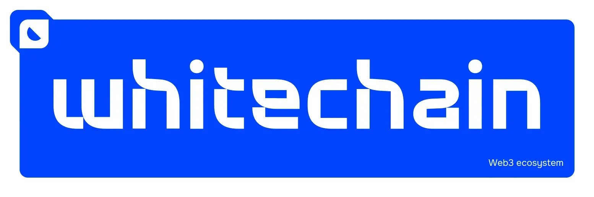

# Whitechain Skills



[Agent Skills](https://agentskills.io) for building on [Whitechain](https://whitechain.io). These skills enable AI agents to connect to Whitechain, deploy and verify contracts, run nodes, and more.

<!-- Badge row 2 - links and profiles -->

[](https://whitechain.io)
[](https://docs.whitechain.io/)
[](https://discord.gg/eZwjxwNsU)
[](https://t.me/whitechain_news_io)
[](https://x.com/Whitechain_io)

## Recommended Skills

| Skill | Install | Description |
| ----- | ------- | ----------- |
| [whitechain-dev](./whitechain-dev/SKILL.md) | `npx skills add whitechain-labs/skills --skill whitechain-dev` | Whitechain developer playbook: network config, contract deployment, Blockscout verification, testnet faucet, and running a node. |
| [whitechain-analytics](./whitechain-analytics/SKILL.md) | `npx skills add whitechain-labs/skills --skill whitechain-analytics` | Read public Blockscout / RPC / GraphQL without keys: error handling, rate limits, BigInt wei, chain IDs, Soul wording. |

## Installation

Install with [Vercel's Skills CLI](https://skills.sh):

```bash
npx skills add whitechain-labs/skills --skill whitechain-dev
npx skills add whitechain-labs/skills --skill whitechain-analytics
```

## Usage

Skills are automatically available once installed. The agent will use them when relevant tasks are detected.

**Examples:**

```text
Deploy my contract to Whitechain Sepolia
```

```text
How do I connect to Whitechain testnet?
```

```text
Verify my contract on Blockscout
```

```text
Get me some testnet WBT
```

## What is a skill?

A skill is a `SKILL.md` file that teaches an AI agent how to perform tasks on a specific network or protocol. When installed, the agent uses the skill's instructions and reference files to complete tasks on your behalf.

Learn more at [agentskills.io](https://agentskills.io).

## Contributing

Open an issue or pull request. Reference files are in `whitechain-dev/references/`.

## License

MIT

---
[Whitechain]: https://whitechain.io
